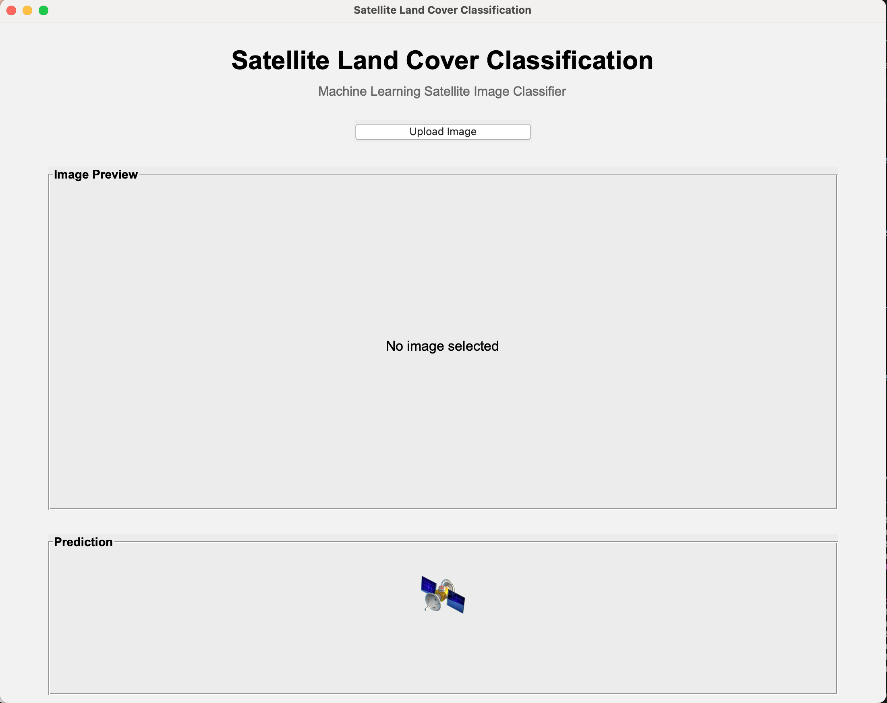
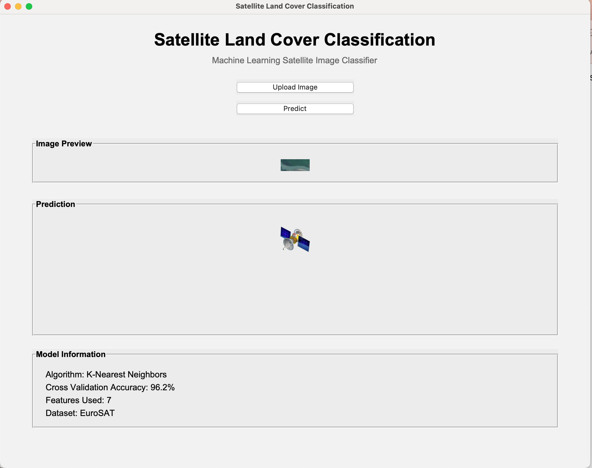
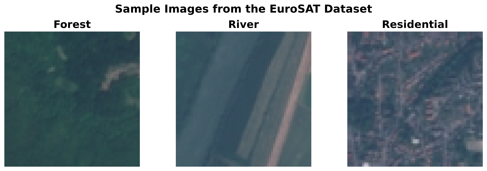
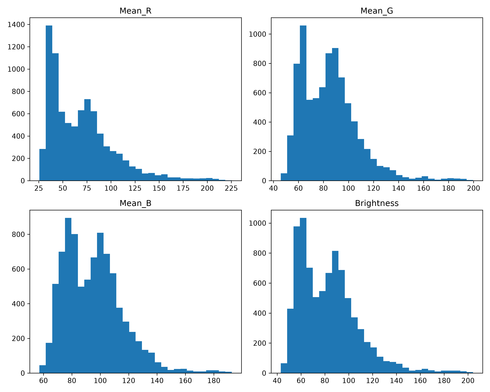
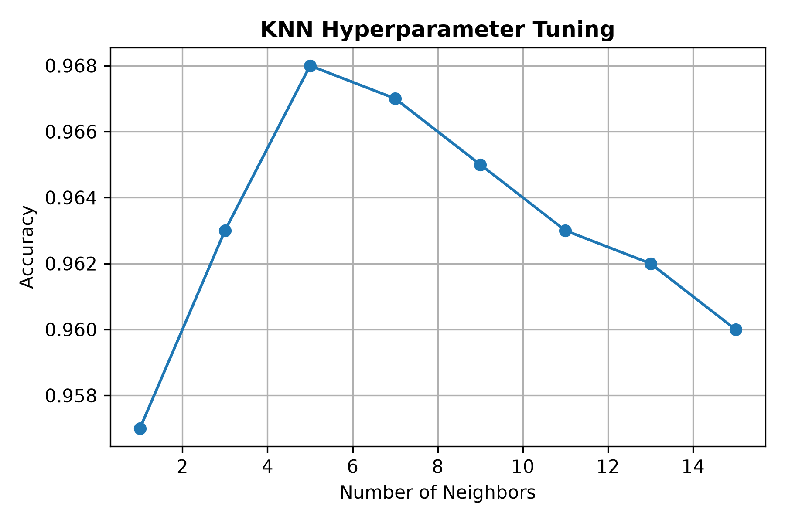
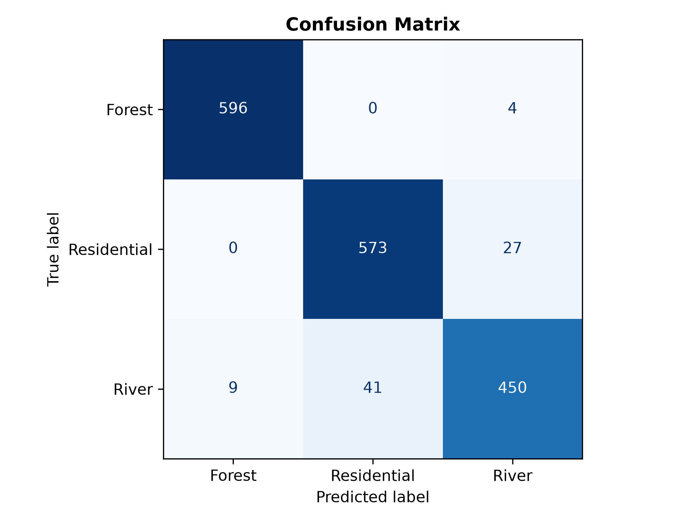

````markdown
# Satellite Land Cover Classification using K-Nearest Neighbors (KNN)

A complete machine learning application that classifies satellite images into **Forest**, **River**, and **Residential** land cover types using engineered RGB image features and a K-Nearest Neighbors (KNN) classifier.

The project includes an interactive desktop application built with **Tkinter**, allowing users to upload satellite images and receive real-time land cover predictions.

**Final Model Accuracy:** **96.76%**

---

# Application Demo

## Home Screen



## Uploading an Image



## Example Prediction


The application displays:

- Uploaded satellite image
- Predicted land cover class
- Confidence score
- Human-friendly class description
- Model information

---

# Project Overview

Satellite imagery plays an important role in environmental monitoring, urban planning, agriculture, and disaster management.

This project demonstrates a complete end-to-end machine learning workflow:

- Image preprocessing
- Feature engineering
- Model training
- Hyperparameter tuning
- Performance evaluation
- Desktop application deployment

Rather than using deep learning, this project focuses on applying traditional machine learning techniques and understanding how image features can be engineered for classification tasks.

---

# Features

- Desktop GUI built with Tkinter
- Upload and classify satellite images
- K-Nearest Neighbors (KNN) classifier
- Confidence score for every prediction
- Human-readable land cover descriptions
- RGB feature engineering pipeline
- Reproducible machine learning workflow

---

# Dataset

This project uses a subset of the **EuroSAT RGB** satellite imagery dataset.

To keep this repository lightweight, the raw dataset is **not included**.

After downloading the dataset, place it in:

```text
data/
└── raw/
    └── eurosat_subset/
        ├── Forest/
        ├── River/
        └── Residential/
````

The processed feature dataset generated during preprocessing is included in:

```text
data/processed/satellite_landcover_features.csv
```

---

# Sample Images



---

# Machine Learning Workflow

```text
Satellite Images
        │
        ▼
Data Exploration
        │
        ▼
Feature Engineering
        │
        ▼
Processed Dataset
        │
        ▼
Train/Test Split
        │
        ▼
K-Nearest Neighbors (K = 5)
        │
        ▼
Model Evaluation
        │
        ▼
Desktop Prediction Application
```

---

# Feature Engineering

Each **64 × 64 RGB satellite image** was transformed into numerical features suitable for traditional machine learning.

Extracted features include:

* Mean Red
* Mean Green
* Mean Blue
* Standard Deviation (Red)
* Standard Deviation (Green)
* Standard Deviation (Blue)
* Overall Brightness

These engineered features allow KNN to distinguish between different land cover classes without using deep learning.

---

# Feature Distribution



---

# Machine Learning Model

## Algorithm

* K-Nearest Neighbors (KNN)

## Training/Test Split

* 80% Training
* 20% Testing

## Hyperparameter Tuning

The model was evaluated using:

* K = 1
* K = 3
* K = 5
* K = 7
* K = 9
* K = 11

The highest testing accuracy was achieved with **K = 5**.

---

# K Value Comparison



---

# Results

## Overall Test Accuracy

**96.76%**

### Confusion Matrix



### Classification Report

| Class       | Precision | Recall | F1 Score |
| :---------- | --------: | -----: | -------: |
| Forest      |      0.99 |   1.00 |     0.99 |
| Residential |      0.94 |   0.98 |     0.96 |
| River       |      0.97 |   0.91 |     0.94 |

---

# Technologies Used

* Python
* NumPy
* Pandas
* Pillow (PIL)
* Matplotlib
* Scikit-learn
* Tkinter
* Joblib
* Jupyter Notebook
* Git
* GitHub

---

# Repository Structure

```text
satellite-landcover-knn/
│
├── app.py
├── src/
│   └── landcover/
│
├── notebooks/
│   ├── 01_data_exploration.ipynb
│   ├── 02_data_preprocessing.ipynb
│   ├── 03_model_training.ipynb
│   └── 04_model_analysis.ipynb
│
├── data/
├── models/
├── images/
├── outputs/
│
├── requirements.txt
└── README.md
```

---

# Future Improvements

* Expand the classifier to all EuroSAT land cover categories.
* Compare KNN with Random Forests, Decision Trees, and Support Vector Machines.
* Train a Convolutional Neural Network (CNN).
* Display probability charts directly inside the application.
* Add drag-and-drop image support.
* Package the application as a standalone desktop executable.

---

# Key Takeaways

This project demonstrates the complete lifecycle of a machine learning application:

* Data exploration
* Image feature engineering
* Data preprocessing
* Model training
* Hyperparameter tuning
* Model evaluation
* Saving and loading trained models
* Building a desktop GUI for real-time predictions
* Version control with Git and GitHub

---

# Author

**Akshara Bharath**

High school student passionate about machine learning, remote sensing, and Earth observation.

GitHub: https://github.com/aksharabharath

