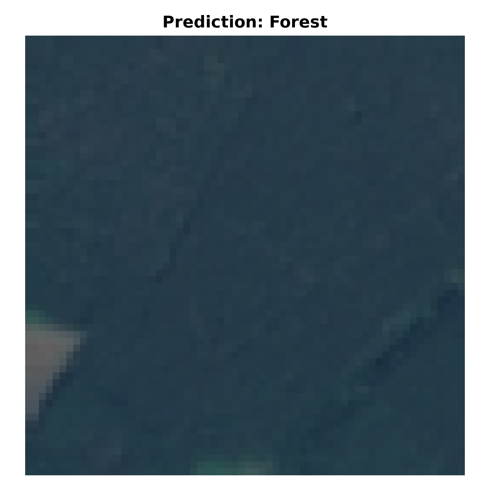
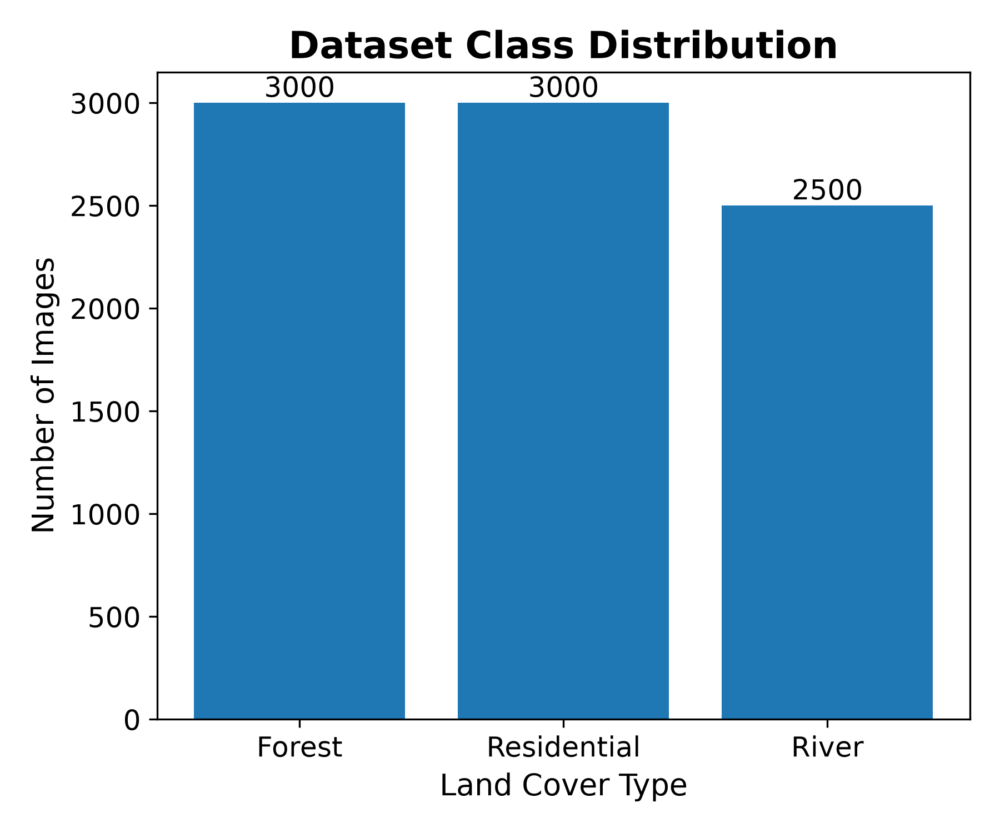

# Satellite Land Cover Classification using K-Nearest Neighbors (KNN)

A machine learning project that classifies satellite images into **Forest**, **River**, and **Residential** land cover types using engineered RGB image features and a K-Nearest Neighbors (KNN) classifier.

**Final Model Accuracy:** **96.76%**

---

# Project Overview

Satellite imagery plays an important role in environmental monitoring, urban planning, agriculture, and disaster management. In this project, I built a complete machine learning pipeline to classify satellite images into three land cover categories:

* Forest
* River
* Residential

Rather than using deep learning, this project focuses on understanding the fundamentals of machine learning through feature engineering, data preprocessing, model training, and evaluation.

---

# Dataset

This project uses a subset of the **EuroSAT RGB** satellite imagery dataset.

To keep this repository lightweight, the raw dataset is **not included**.

After downloading the dataset, place it in:

```text
data/
└── raw/
    └── eurosat_subset/
        ├── Forest/
        ├── River/
        └── Residential/
```

The processed feature dataset generated during preprocessing is included in:

```text
data/processed/satellite_landcover_features.csv
```

## Sample Images

Below are example satellite images from each land cover class.


---

# Project Workflow

```text
Satellite Images
        │
        ▼
Data Exploration
        │
        ▼
Feature Extraction
(RGB Means, Standard Deviations, Brightness)
        │
        ▼
Processed Dataset
        │
        ▼
Train/Test Split
        │
        ▼
K-Nearest Neighbors (K = 5)
        │
        ▼
Model Evaluation
        │
        ▼
Predict New Satellite Images
```

---

# Feature Engineering

Each **64 × 64 RGB satellite image** was converted into numerical features suitable for machine learning.

Extracted features include:

* Mean Red value
* Mean Green value
* Mean Blue value
* Standard deviation of the Red channel
* Standard deviation of the Green channel
* Standard deviation of the Blue channel
* Overall image brightness

These engineered features transformed every image into a numerical representation that could be used by a traditional machine learning model.

## Feature Distribution

The engineered RGB features create separable clusters that allow the KNN classifier to distinguish between different land cover classes.


---

# Machine Learning Model

## Algorithm

* K-Nearest Neighbors (KNN)

## Training/Test Split

* 80% Training
* 20% Testing

## Hyperparameter Tuning

To determine the optimal number of neighbors, the model was evaluated using multiple values of **K**:

* K = 1
* K = 3
* K = 5
* K = 7
* K = 9
* K = 11

The highest testing accuracy was achieved with **K = 5**.

## K Value Comparison


---

# Results

## Confusion Matrix

The confusion matrix summarizes the model's performance on the testing dataset.


## Example Prediction

The trained model successfully predicts the land cover class of an unseen satellite image.



## Classification Report

| Class       | Precision | Recall | F1 Score |
| ----------- | --------: | -----: | -------: |
| Forest      |      0.99 |   1.00 |     0.99 |
| Residential |      0.94 |   0.98 |     0.96 |
| River       |      0.97 |   0.91 |     0.94 |

**Overall Test Accuracy:** **96.76%**

---

# Technologies Used

* Python
* NumPy
* Pandas
* Pillow (PIL)
* Matplotlib
* Seaborn
* Scikit-learn
* Jupyter Notebook
* Git
* GitHub

## Dataset Distribution

The dataset contains three land cover categories.



---

# Repository Structure

```text
satellite-landcover-knn/
│
├── data/
│   ├── raw/
│   └── processed/
│
├── images/
│
├── models/
│
├── notebooks/
│   ├── 01_data_exploration.ipynb
│   ├── 02_data_preprocessing.ipynb
│   ├── 03_model_training.ipynb
│   └── 04_model_analysis.ipynb
│
├── README.md
└── requirements.txt
```

---

# Future Improvements

Possible future extensions include:

* Expanding the model to classify all EuroSAT land cover categories.
* Comparing KNN with Decision Trees, Random Forests, and Support Vector Machines.
* Training a Convolutional Neural Network (CNN) directly on image pixels.
* Exploring FAISS for scalable nearest-neighbor search on larger image datasets.

---

# Key Takeaways

This project demonstrates the complete machine learning workflow:

* Data exploration
* Image feature engineering
* Data preprocessing
* Model training
* Hyperparameter tuning
* Performance evaluation
* Prediction on unseen satellite images
* Building a reproducible machine learning project using Git and GitHub